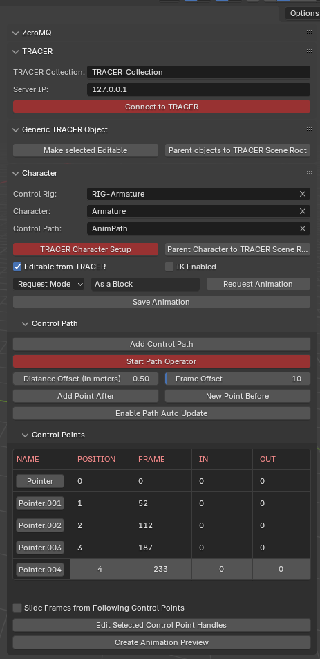

# TRACER Scene Distribution Plugin Blender

## How to install the TRACER Add-On for Blender
There are two ways to proceed depending on whether you want to dowlnoad the whole repo or you are just interested in the TRACER Add-On and you want to get straight to the point.
### Download the dedicated TRACER Add-On for Blender Release archive
In the Realeses section, a zip archive of TRECER Add-On for Blender is made available for download. Having downloaded it, it can be installed by going to Edit > Preferences > Add-Ons in Blender, clicking on the "Install" button, and selecting the zip file of the TRACER Add-On wherever it has been saved on your computer.
Don't forget to enable it, by cheching the box next to it and you're all set up! 
### Download or clone the repository 
If you want to have the whole repository on your machine, for playing around with it a bit more, you can either simply zip the Blender folder in the repo and install it as detailed above, or bind your favourite text editor to blender in order to modify the Add-On and extend its functionalities.

[//]: # (Looking for a better solution to connect repo and blender, so that when someone pulls from github blenders sees the updated version of the add-on)

## Requirements
The Add-On is developed for and tested on Blender 4.2.1 and 4.2.9 on previous versions some function calls return errors because of a change in the internal blender API.

In order to exploit the full set of functionalities of [TRACER](https://github.com/FilmakademieRnd/TRACER) (insert link), an up-to-date version of [DataHub](https://github.com/FilmakademieRnd/DataHub) is needed, [AnimHost](https://github.com/FilmakademieRnd/AnimHost) and other clients (like [VPET](https://github.com/FilmakademieRnd/VPET)) integrate in the same TRACER framework and can enhance the capabilities of this Add-On.

## Introduction

Click to view TRACER Add-on Panel screenshot

Now you can open the Add-on side panel, to the right of the 3D viewport, next to the viewing options and select the TRACER Add-on.

At the top of the panel, check whether the "Install ZMQ" button is present, if so click it. Without ZMQ, all communications with TRACER cannot be performed. Then, pay attention to any red buttons appearing in the panel.

You need to set up the scene, clicking "TRACER Scene Setup", to create the collection and scene root where all the objects to be shared through TRACER will reside. The two fields below the button should be already correctly prefilled for local use, but can be customized if you want to use a different collection or connect to a different IP Address (it could be less reliable).

Now, you can import a character in the scene and, when you're done, fill the "Character" text field in the panel with its name (either drag-and-dropping the name in the field, or typing it using the built-in autocomplete). As soon as the field is correctly filled, you can click on "Parent Character to TRACER Scene Root" including the character, therefore, in the TRACER Scene. Then you can click on the highlighted button "TRACER Character Setup", to process the skeletal information of the character and prepare the information to be shared with other TRACER clients. Take care of keeping the selected character "TRACER Editable" if you want to receive updates from other clients (e.g. AnimHost).

If you don't already have a Control Path in the Scene, you can create a new one by clicking "Add Control Path". Otherwise, type the name of the object representing the Control Path in the corresponding field and remember to click "Start Path Operator" every time you open the scene in blender. The button will be highlighted in red if the user-path interaction listener still has to be started.

Now you can edit the Control Path as you like:
- To add more control points, use the "Add After" and "Add Before" buttons or the shortcuts Ctrl + + and Ctrl + Shift + + respectively
- To move and rotate them, select them and click G and R respectively
- To edit the handles, select a Control Point and either click the "Edit Selected Control Point Handles" button at the bottom of the panel or simply switch to "Edit Mode"; to get out of such mode one can click "Exit Handle Editing Mode" or get back to "Object Mode"
- To delete a Control Point, just select it and delete it (clicking X or Del), everything else should be updated normally (ignore eventual errors displayed on screen...they should not create any issue down the line). To update the curve visualization now you probably have to select one of the Control Points left and then click again. I couldn't figure out why.
- To edit the Control Points additional metadata (Frame, Ease In and Ease Out) take care of enabling the path Auto Update, select one of the Points by either clicking on the Object in the 3D viewport or on the button in the first column in the grid and edit the values. The order of the Pointers can be changed by editing the Position field.
- By changing the Distance and Frame offset you can decide where new points get spawned and how many frames should they have from the previous pointer
- By enabling the "Slide Frames" functionality (the checkbox above "Edit Selected Control Point Handles"), when changing the Frame field of a Pointer all the following pointers will be affected maintaining all the deltas as they are.
- To pre-visualise the crafted animation, click "Create Animation Preview" and update it with "Update Animation Preview"

When everything is done, connect to TRACER using the highlighted button at the top.

When that is done, and both DataHub and AnimHost are running, click "Request Animation". You can decide whether to receive the animation as a stream or as a block. The selection menu is to the left of the button.

If you requested it as a block, the animation will fill the timeline and you can play it back as usual. If you like it, you can bake it on the character as a NLA Action using the "Save Animation" button.

# License

Please review the [License file](License_Info.txt).
